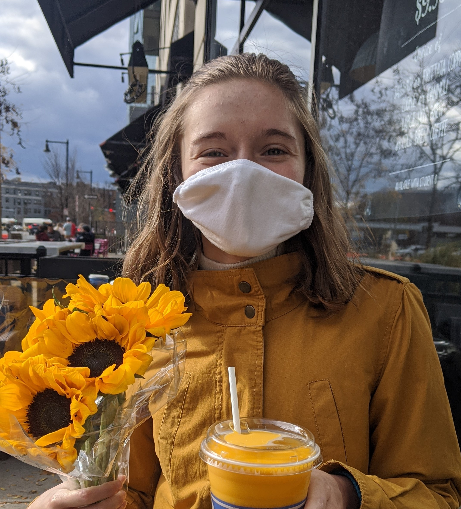

## About Me

Hello! I am a student studying Electrical and Computer Engineering at the <a href="https://olin.edu">Olin College of Engineering</a>.

## Portfolio

- [Reverse Engineering with Ghidra](https://sites.google.com/view/ghidra-reverse-engineering/home#h.s1qs2m8gk4s9), a resource for people new to reverse engineering with some practice exercises included.
- [Connect4cks](https://github.com/sam-coleman/Connect_4), an AI that plays Connect 4. 
- [CPU to GPU Communication](https://comparch.goose.gay/), a resource explaining the architectural differences between the CPU and GPU, the hardware and software support of CUDA, and how GPGPU computing works (for a machine learning workload). 
- [Making Music from Movement](https://caitlincoffey.github.io/Movement-Synthesizer/), an algorithm that converts movement from an accelerometer into unique music via DFTs and music theory.
- [QEA Faces](/qeafaces), a facial recognition algorithm that detects one's age, race, and gender using principal component analysis, eigenvalue decomposition, and a K-nearest neighbor search. 
- [Modeling Trains on the Bay Area Rapid Transit System](/modsimbikeshare), a model of the yellow line of the B.A.R.T. to find the most optimal amount of train cars. 
